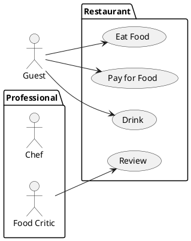
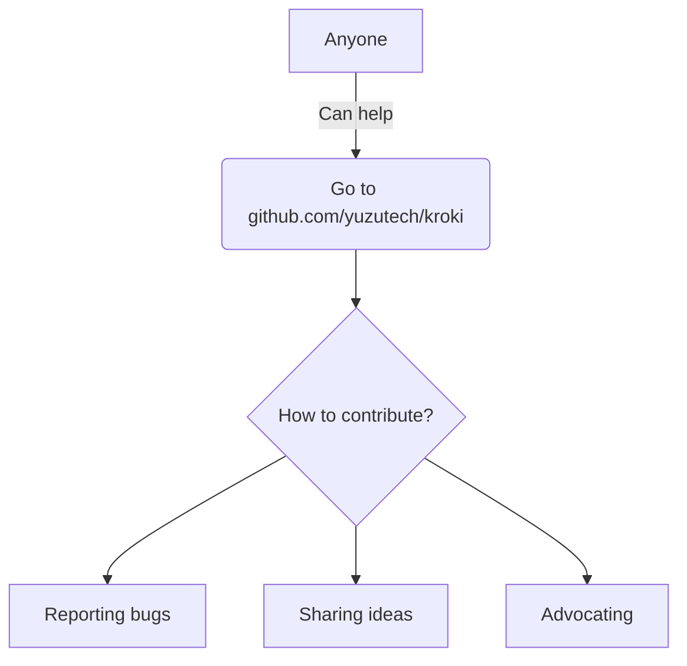

# @kazumatu981/markdown-it-kroki

## Marp Sample

---

## plantuml



---

## mermaid



---

## normal code

```JavaScript
function testFunc(test) {
  let sum = 0;
  for(let x = 1; x<=test; x++) {
    sum += x;
  }
  return sum;
}
```