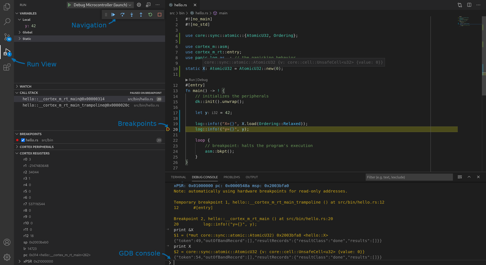

# Using GDB

To debug embedded Rust applications with GDB we currently recommend using tooling like OpenOCD,
JLinkGDBServer or pyOCD

Although `cargo-embed` v0.10 (and v0.10 of `probe-rs`, the library that powers `cargo-embed`)
support spawning a GDB server it has some limitations
- stepping through the code (e.g. GDB's `step` and `next` commands) is imprecise or doesn't work in
  some cases
- it's not possible to have a GDB server and RTT channels running at the same time so you can use GDB OR RTT but not both together (this limitation is likely to be removed in v0.11)

The rest of this section covers how to debug an embedded application within VS code using OpenOCD as
the GDB server.

## Dependencies

1. You'll need to install OpenOCD. Installation instructions vary depending on your OS.

2. Install the [cortex-debug](https://marketplace.visualstudio.com/items?itemName=marus25.cortex-debug) extension in VS code. Head to the extensions marketplace and search for
   "cortex-debug". Latest version at the time of writing is 0.3.7 and the author of the extension is
   "marus25"

## Preparation

For the best debugging experience, the `dev` (development) compilation profile should be set to its
default settings.
For this tutorial, we'll be using the `beginner/` applications, so let's modify `beginner/apps/Cargo.toml` to revert the `dev` profile to its default.

``` diff
 panic-log = { path = "../../common/panic-log" }

 # optimize code in both profiles
-[profile.dev]
-codegen-units = 1
-debug = 1
-debug-assertions = true # !
-incremental = false
-lto = "fat"
-opt-level = 'z' # !
-overflow-checks = false

 [profile.release]
```

## How to

1. In VS code, from the top menu pick "File" > "Open folder". Then open the `beginner/apps` folder.

2. Within this folder, open the `src/bin/hello.rs` file.

3. From the top menu, pick "Run" > "Start Debugging".

You are now in a GDB session. Switch to the "Run" view (4th icon from the top on the left sidebar)
and you'll see debug information like the call stack, local variables, breakpoints and CPU registers
on the left side. On the bottom panel, you can switch to the "Debug console" to issue commands to
the GDB server. Near the top of the GUI you'll find a row of buttons to navigate through the program
(step, continue, etc.). Breakpoints can be added by clicking to the left of line numbers in the file
view.



## Debugging a different program

To debug a different program within the `beginner/apps` folder you'll need to modify the
`beginner/apps/.vscode/launch.json` file as follows:

``` diff
 {
     "version": "0.2.0",
     "configurations": [
       {
         "cwd": "${workspaceRoot}",
-        // TODO to debug a different program the app name ("hello") needs to be changed
-        "executable": "./target/thumbv7em-none-eabihf/debug/hello",
+        "executable": "./target/thumbv7em-none-eabihf/debug/blinky",
         "name": "Debug Microcontroller (launch)",
```

Change the name of the program from `hello` to whichever program you wish to debug.
