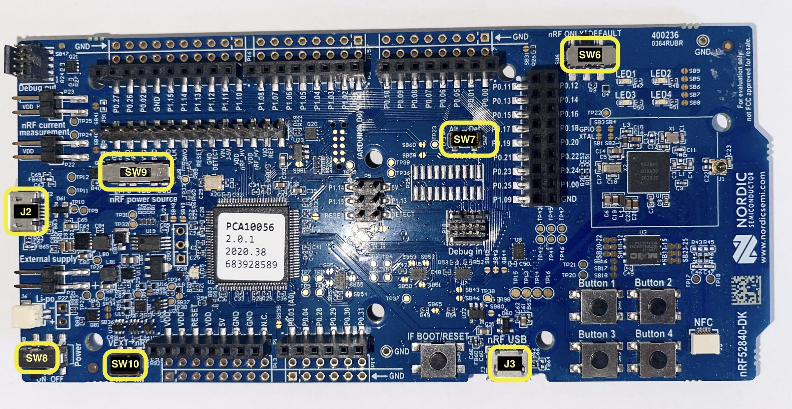

# Checking the Hardware

## nRF52840 Dongle

Connect the Dongle to your PC/laptop. Its red LED should start oscillating in intensity. The device will also show up as:

**Windows**: a USB Serial Device (COM port) in the Device Manager under the Ports section

**Linux**: a USB device under `lsusb`. The device will have a VID of `0x1915` and a PID of `0x521f` -- the `0x` prefix will be omitted in the output of `lsusb`:

``` console
$ lsusb
(..)
Bus 001 Device 023: ID 1915:521f Nordic Semiconductor ASA 4-Port USB 2.0 Hub
```

The device will also show up in the `/dev` directory as a `ttyACM` device:

``` console
$ ls /dev/ttyACM*
/dev/ttyACM0
```

**macOS**: a usb device when executing `ioreg -p IOUSB -b -n "Open DFU Bootloader"`. The device will have a vendor ID (`"idVendor"`) of `6421` and a product ID (`"idProduct"`) of `21023`:

``` console
$ ioreg -p IOUSB -b -n "Open DFU Bootloader"
(...)
| +-o Open DFU Bootloader@14300000  <class AppleUSBDevice, id 0x100005d5b, registered, matched, ac$
  |     {
  |       (...)
  |       "idProduct" = 21023
  |       (...)
  |       "USB Product Name" = "Open DFU Bootloader"
  |       (...)
  |       "USB Vendor Name" = "Nordic Semiconductor"
  |       "idVendor" = 6421
  |       (...)
  |       USB Serial Number" = "CA1781C8A1EE"
  |       (...)
  |     }
  |
```

The device will show up in the `/dev` directory as `tty.usbmodem<USB Serial Number>`:

``` console
$ ls /dev/tty.usbmodem*
/dev/tty.usbmodemCA1781C8A1EE1
```

## nRF52840 Development Kit (DK)

Connect one end of a micro USB cable to the USB connector *J2* of the board and the other end to your PC.

💬 These directions assume you are holding the board "horizontally" with components (switches, buttons and pins) facing up. In this position, rotate the board, so that its convex shaped short side faces right. You'll find one USB connector (J2) on the left edge, another USB connector (J3) on the bottom edge and 4 buttons on the bottom right corner.




After connecting the DK to your PC/laptop it will show up as:

**Windows**: a removable USB flash drive (named JLINK) and also as a USB Serial Device (COM port) in the Device Manager under the Ports section

**Linux**: a USB device under `lsusb`. The device will have a VID of `0x1366` and a PID of `0x10??` or `0x01??` (`?` is a hex digit)  -- the `0x` prefix will be omitted in the output of `lsusb`:

``` console
$ lsusb
(..)
Bus 001 Device 014: ID 1366:1015 SEGGER 4-Port USB 2.0 Hub
```

The device will also show up in the `/dev` directory as a `ttyACM` device:

``` console
$ ls /dev/ttyACM*
/dev/ttyACM0
```

**macOS**: a removable USB flash drive (named JLINK) in Finder and also a USB device named "J-Link" when executing `ioreg -p IOUSB -b -n "J-Link"`.

``` console
$ ioreg -p IOUSB -b -n "J-Link"
(...)
  | +-o J-Link@14300000  <class AppleUSBDevice, id 0x10000606a, registered, matched, active, busy 0 $
  |     {
  |       (...)
  |       "idProduct" = 4117
  |       (...)
  |       "USB Product Name" = "J-Link"
  |       (...)
  |       "USB Vendor Name" = "SEGGER"
  |       "idVendor" = 4966
  |       (...)
  |       "USB Serial Number" = "000683420803"
  |       (...)
  |     }
  |
```

The device will also show up in the `/dev` directory as `tty.usbmodem<USB Serial Number>`:

``` console
$ ls /dev/tty.usbmodem*
/dev/tty.usbmodem0006834208031
```

The board has several switches to configure its behavior. The out of the box configuration is the one we want. If the above instructions didn't work for you, check the position of the following switches:

- SW6 is set to the DEFAULT position (to the right - nRF = DEFAULT).
- SW7 (protected by Kapton tape) is set to the Def. position (to the right - TRACE = Def.).
- SW8 is set to the ON (to the left) position (Power = ON)
- SW9 is set to the VDD position (center - nRF power source = VDD)
- SW10 (protected by Kapton tape) is set to the OFF position (to the left - VEXT -> nRF = OFF).

For reference, here's the board picture again:

