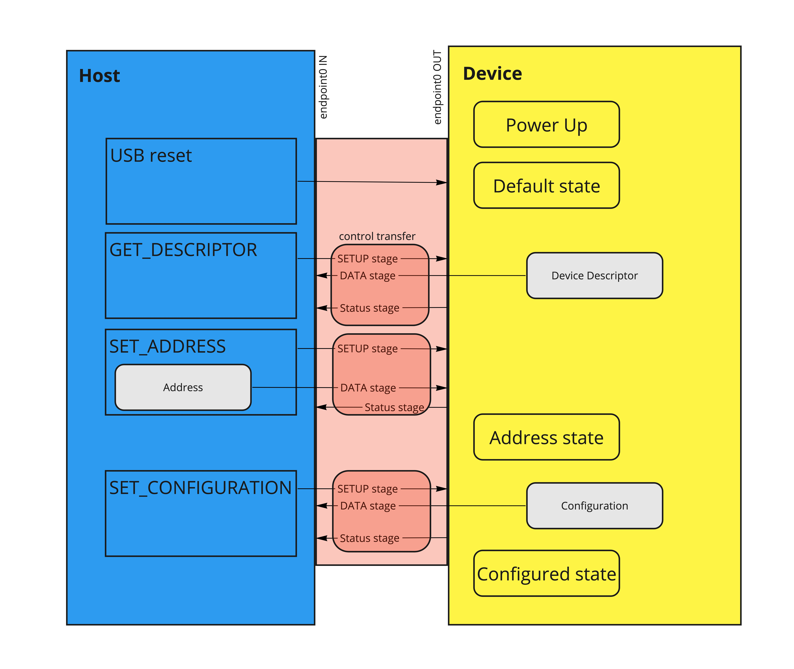

# USB Enumeration

[Screenshot taken from miro board](https://miro.com/app/board/uXjVObcQhcc=/?invite_link_id=467100096053)

A USB device, like the nRF52840, can be one of these three states:

- the Default state,
- the Address state, or
- the Configured state

After being powered the device will start in the Default state. The enumeration process will take the device from the Default state to the Address state. As a result of the enumeration process the device will be assigned an address, in the range `1..=127`, by the host.

The USB protocol is complex so we'll leave out many details and focus only on the concepts required to get enumeration and configuration working. There are also several USB specific terms so we recommend checking chapter 2, "Terms and Abbreviations", of the USB specification (linked at the bottom of this document) every now and then.

Each OS may perform the enumeration process slightly differently but the process will always involve these host actions:

- USB reset: put the device in the Default state, regardless of what state it was in.
- GET_DESCRIPTOR: request to get the device descriptor.
- SET_ADDRESS: request to assign an address to the device.

These host actions will be perceived as *events* by the nRF52840. During this workshop, we will gradually parse and handle these events and learn more about Embedded Rust along the way.

There are more USB concepts involved that we'll need to cover, like descriptors, configurations, interfaces and endpoints but for now let's see how to handle USB events.

For each step of the course, we've prepared a `usb-<n>.rs` file that gives you a base structure and hints on how to proceed. The matching `usb-<n>-solution.rs` contains a sample solution should you need it. Switch from `usb-<n>.rs` to `usb-<n+1>.rs` when instructed and continue working from there. Please keep the USB cable plugged into J3 through all these exercises. 